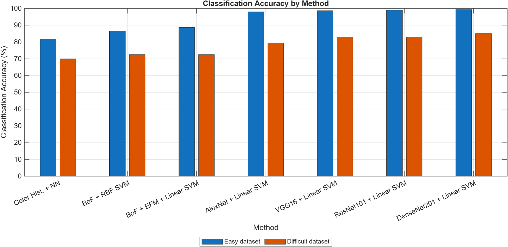
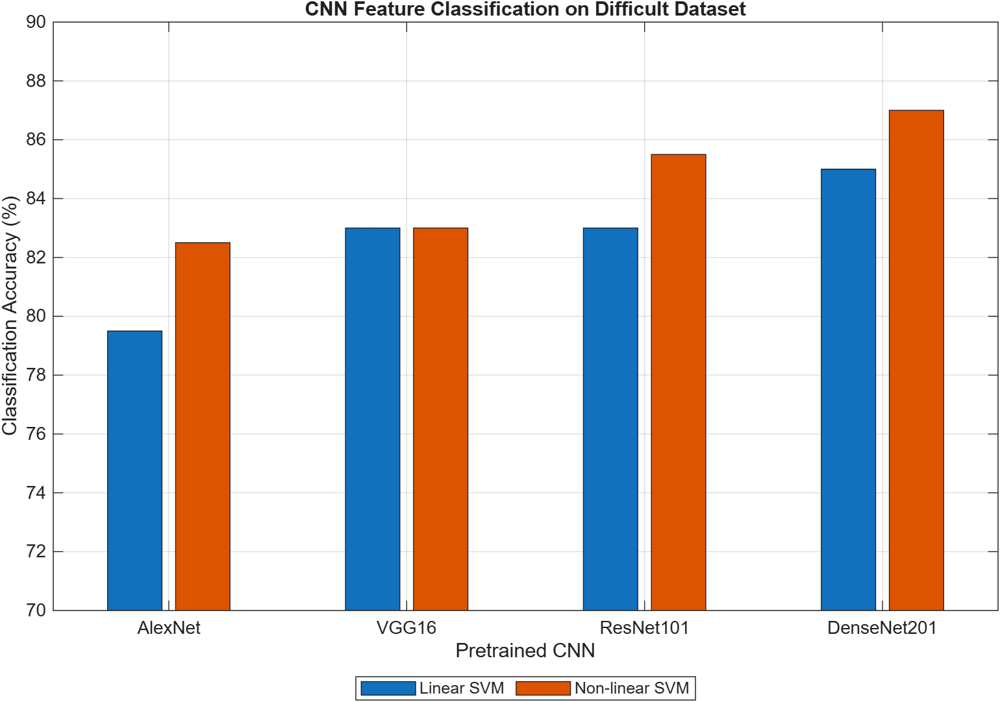

# Image Recognition Report
大学講義「物体認識論」の最終課題として作成した、画像分類およびWeb画像検索リランキングの実験プログラムです。

MATLABを用いて、Color HistogramやBag of Featuresといった従来型の画像特徴量と、
学習済みCNNから抽出した特徴量を比較しました。

また、Flickrから取得したノイズを含む画像検索結果に対して、
CNN特徴量とSVMを用いて画像を再ランキングする処理を実装しました。

## 概要

この課題では、主に以下の2つの実験を行いました。

### Task 1: 2クラス画像分類

Webから収集した画像を用いて2クラス分類を行い、
複数の特徴抽出・分類手法について5-fold cross validationで分類精度を比較しました。

分類対象には、

- 比較的分類しやすい組み合わせ
- 見た目が類似しており分類が難しい組み合わせ

の2種類を用意し、手法による性能差を比較しました。

### Task 2: Web画像検索結果の再ランキング

Flickrから取得したノイズを含む画像群に対して、
学習済みCNNから特徴量を抽出し、線形SVMによって評価しました。

SVMの出力スコアを用いて画像を並べ替えることで、
元の検索結果よりも目的画像が上位に現れるよう再ランキングしました。


## 使用技術

- MATLAB / MATLAB Online
- Color Histogram
- Bag of Features (BoF)
- k-Nearest Neighbor
- Support Vector Machine (SVM)
- AlexNet
- VGG16
- ResNet101
- DenseNet201
- 5-fold Cross Validation
- Flickr API


## Task 1: 2クラス画像分類

以下の11種類の手法を実装・比較しました。

1. Color Histogram + Nearest Neighbor
2. BoF + Non-linear SVM
3. AlexNet feature + Linear SVM
4. VGG16 feature + Linear SVM
5. BoF + Explicit Feature Map + Linear SVM
6. ResNet101 feature + Linear SVM
7. DenseNet201 feature + Linear SVM
8. AlexNet feature + Non-linear SVM
9. VGG16 feature + Non-linear SVM
10. ResNet101 feature + Non-linear SVM
11. DenseNet201 feature + Non-linear SVM

CNNを用いた手法では、学習済みネットワークの最終分類層より前の中間層から特徴量を抽出し、
その特徴量をSVMへ入力して分類しています。


## 分類結果

5-fold cross validationによる分類精度の一部を以下に示します。

| Method | Easy dataset | Difficult dataset |
|---|---:|---:|
| Color Histogram + NN | 81.67% | 70.00% |
| BoF + Non-linear SVM | 86.67% | 72.50% |
| AlexNet + Linear SVM | 98.00% | 79.50% |
| VGG16 + Linear SVM | 98.67% | 83.00% |
| ResNet101 + Linear SVM | 99.00% | 83.00% |
| DenseNet201 + Linear SVM | 99.33% | 85.00% |
| DenseNet201 + Non-linear SVM | 99.33% | 87.00% |

特に分類が難しいデータセットでは、
Color HistogramやBoFと比較してCNN特徴量を用いた手法が高い分類精度を示しました。


### 手法全体の比較

従来の特徴量とCNN特徴量を用いた手法について、5-fold cross validationによる分類精度を比較しました。



Color HistogramやBoFと比較して、学習済みCNNから抽出した特徴量を用いた手法で高い分類精度が得られました。
特に、見た目が類似した難しいデータセットでは手法による差が大きく現れました。


### CNN特徴量とSVMの比較

難しいデータセットについて、使用するCNNとSVMの種類による分類精度の違いを比較しました。



AlexNet、VGG16、ResNet101、DenseNet201の順に高い精度を示す傾向が見られました。
また、非線形SVMでは一部のモデルで精度が向上しましたが、CNN特徴量では線形SVMでも高い分類性能が得られました。


## Task 2: Web画像検索の再ランキング

Flickrの画像検索結果には、検索キーワードと直接関係しない画像も多く含まれます。

そこで以下の処理を実装しました。

1. Flickrから学習用画像を取得
2. VGG16からDCNN特徴量を抽出
3. 線形SVMを学習
4. ノイズを含む検索画像300枚から特徴量を抽出
5. SVMの出力スコアを計算
6. スコアの高い順に画像を並べ替え

処理の流れ：

```text
Flickr images
    ↓
VGG16 feature extraction
    ↓
Linear SVM
    ↓
SVM score
    ↓
Re-ranking


## 再ランキング結果

検索結果上位100枚に含まれる正解画像数を比較しました。

| Keyword | Training images | Before | After |
|---|---:|---:|---:|
| ramen | 25 | 34 | 100 |
| ramen | 50 | 34 | 100 |
| sushi | 25 | 30 | 65 |
| sushi | 50 | 30 | 62 |

特にラーメン画像では、再ランキング前は上位100枚中34枚だった正解画像が、
再ランキング後には100枚まで増加しました。


## 考察・得られた知見

### 1. 特徴表現による性能差

Color Histogramは画像全体の色分布を利用するため、
色彩が似たクラス同士では分類性能が低下しました。

一方、CNN特徴量では色だけでなく、
エッジ、テクスチャ、形状などを含む特徴表現を利用できるため、
見た目が類似したクラスでも高い分類精度を得ることができました。

### 2. CNNモデルによる違い

今回の実験では、AlexNetよりもVGG16、ResNet101、DenseNet201などを用いた場合に、
難しいデータセットで高い精度を示す傾向が見られました。

### 3. 線形SVMでも高い性能を得られた

CNNから抽出した特徴量では、
非線形SVMだけでなく線形SVMでも高い分類性能を得られました。

CNNによる特徴抽出の段階で、
分類しやすい特徴空間へ変換されていることが一因だと考えました。

### 4. データの質の重要性

Web画像検索の再ランキングでは、
学習画像を増やせば必ず性能が向上するわけではありませんでした。

寿司画像では学習画像を25枚から50枚へ増やした際、
正解画像数が65枚から62枚へわずかに低下しました。

Webから収集した画像にはノイズが含まれるため、
モデルだけでなく学習データの選定・品質管理も重要であることを学びました。


## ファイル構成

### Task 1

- `repo1.m`
  - 各特徴量・分類器を用いた2クラス分類と5-fold cross validationを実行

- `makeLimg.m`
  - 学習・評価用画像データを整理

- `makeCodebookBoF.m`
  - BoF用コードブックの生成と特徴ベクトル化

### Task 2

- `repo2.m`
  - CNN特徴量抽出、SVM学習、検索画像の評価・再ランキングを実行


## 実行環境

- MATLAB Online
- MATLAB Deep Learning Toolbox
- MATLAB Statistics and Machine Learning Toolbox

※ 学習済みネットワークおよび画像データが必要です。


## 詳細レポート

実験条件、各手法の詳細、正解・誤分類画像の分析、考察については、提出した最終レポートにまとめています。

[物体認識論 最終レポート（PDF）](report/lastReport.pdf)


## 今後改善したい点

- Python / PyTorchを用いた再実装
- Fine-tuningを用いた場合との性能比較
- Precision / Recall / F1-scoreなどを含めた評価
- Web画像のノイズ除去・学習データ選定の自動化
- より新しい画像認識モデルとの比較
